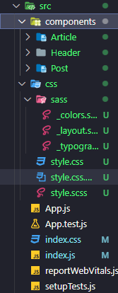

# Front_React_js

estudos de react js

```bash
nps create-react-app

npm start
```



## Criando componentes

```javascript
import Post from "../Post";

function Article() {
  return (
    <>
      <h1>Article</h1>
      <Post />
    </>
  );
}

export default Article;
```

## Props Componentes

```javascript
// Componente pai
function Pai() {
  return <Filho name="João" />;
}

// Componente filho
function Filho(props) {
  return <p>Olá, {props.name}!</p>;
}

// Renderiza o componente pai
ReactDOM.render(<Pai />, document.getElementById('root'));
```

## JSON Server & API

cria uma aquivo db.json na raiz do projeto;

```javascript
npm install -g json-server

npx json-server --watch db.json --port 4000

// a porta pode ser qualquer uma que nao seja utilizado

```

## Testando API c Thunder Client

fiz o dowload da extensao Thunder Client pra fazer os testes do metos

- GET
- POST
- PATCH
- DELETE
